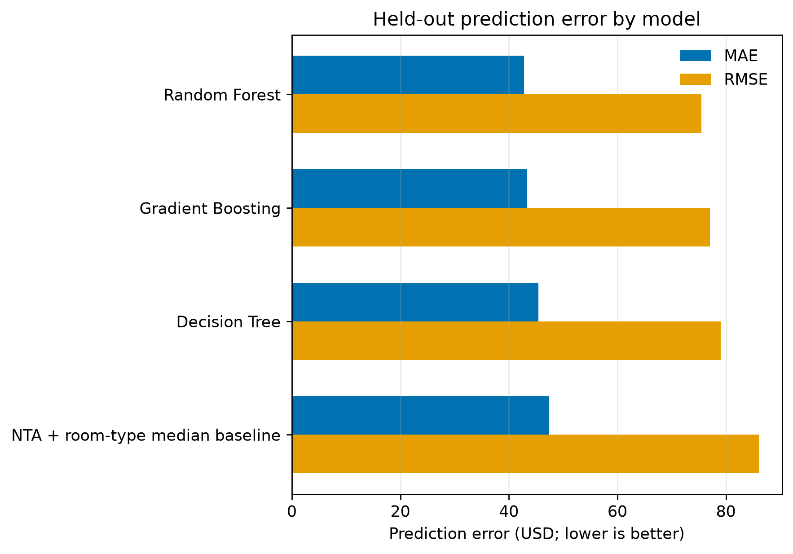
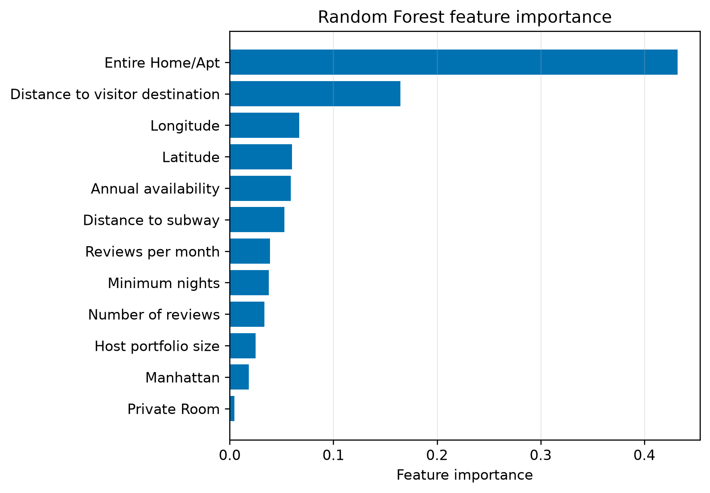
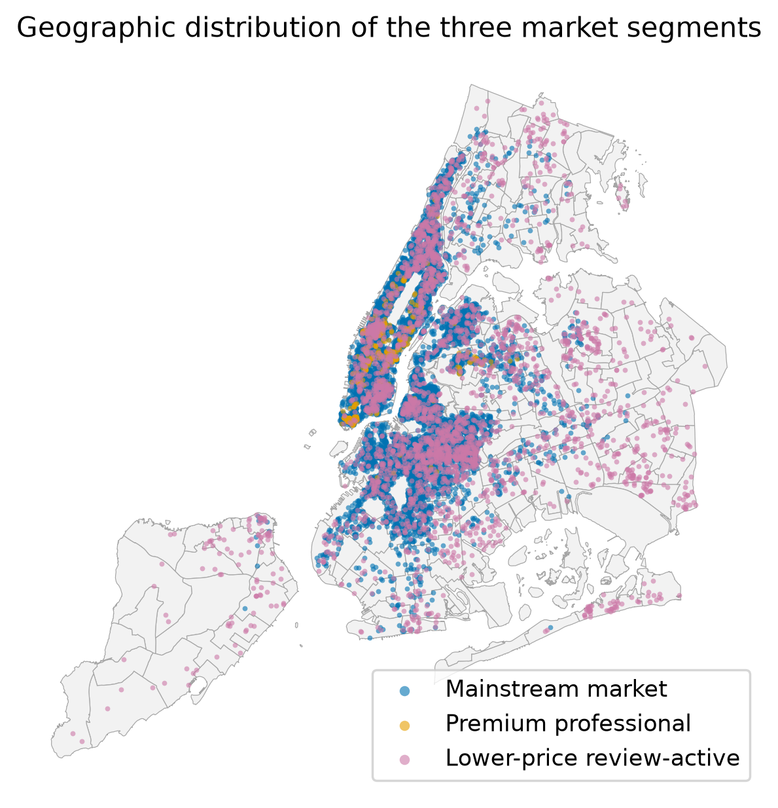
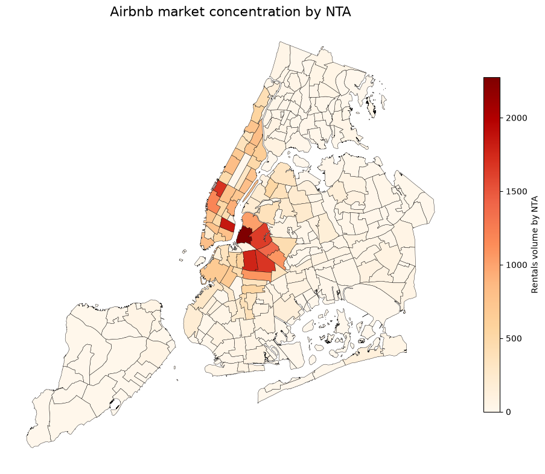
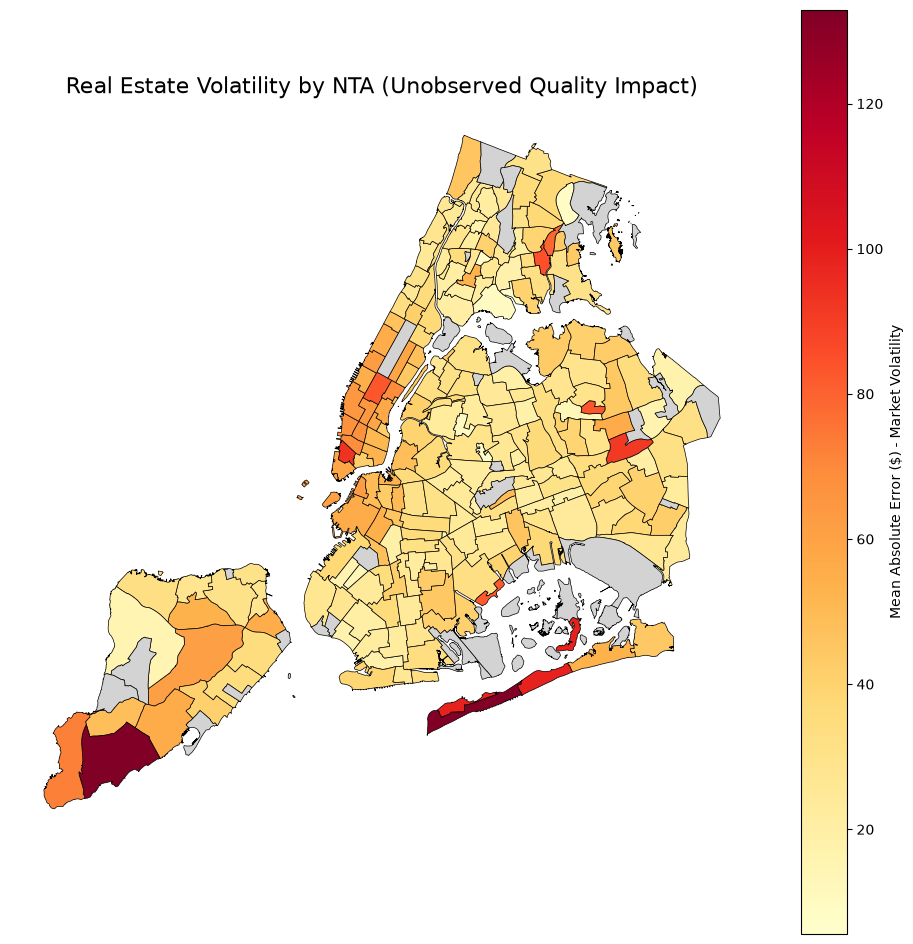

# Airbnb Spatial Price Modelling

*An analysis of New York City Airbnb asking prices, market segments and neighbourhood prediction error using classical machine learning and spatial features.*

<p align="center">
  <a href="https://github.com/John-JonSteyn/AirBNBSpatialPriceModelling/stargazers"></a>
  <a href="https://github.com/John-JonSteyn/AirBNBSpatialPriceModelling"></a>
  <a href="https://github.com/John-JonSteyn/AirBNBSpatialPriceModelling/commits/main"></a>
</p>

**[Project team](#contributors-and-attribution):** Julio Espinosa Rifel, Džemal Jukić, Zee Mehmood, John-Jon Steyn and Patrick Tosto.

---

## Overview

This repository presents the analysis reported in *Airbnb Business Analysis Using a Data Science Approach*, a University of Essex Machine Learning team project. It contains the analysis notebook, the report's five figures and instructions for reproducing the workflow.

The study combines the 2019 New York City Airbnb dataset with neighbourhood boundaries, subway entrances and 12 selected visitor destinations. Decision Tree, Random Forest and Gradient Boosting regressors estimate asking prices; K-means identifies exploratory market segments. Out-of-fold prediction errors show where the available features support less accurate price estimates.

Random Forest achieved the lowest held-out error among the tested models, with a mean absolute error of **USD 42.79**. Room type and proximity to visitor destinations were its strongest predictors. Errors varied geographically, supporting price guidance that accounts for neighbourhood-level model performance.

The implemented regression includes review history. Its reported performance therefore describes established listings; a model for genuinely new listings requires a separate evaluation using features available before their first review.

## Business Question

> How can an Automated Valuation Model (AVM) use listing, host, review and spatial features to predict Airbnb asking prices in New York City, and which geographic areas show the greatest pricing uncertainty?

The analysis addresses four questions:

1. Which tested regression model estimates asking prices most accurately, and how does it compare with a median-price baseline?
2. Which listing and spatial features contribute most to the fitted model?
3. What market segments emerge from listing, host, review and accessibility characteristics?
4. Which neighbourhoods have the highest prediction errors, and how should that affect pricing guidance?

---

## Findings

### Summary

* Random Forest achieved a held-out MAE of USD 42.79 and RMSE of USD 75.52.
* Entire-home/apartment status and distance to a visitor destination had feature-importance scores of 0.432 and 0.165.
* K-means identified mainstream, premium professional and lower-price review-active segments.
* Listings were concentrated in Manhattan and nearby Brooklyn neighbourhoods.
* The report identified Tribeca-Civic Center, Midtown-Times Square and East Midtown-Turtle Bay as high-error areas requiring more cautious price guidance.

### Model Performance

The submitted report records the following Random Forest results. Cross-validation was performed within the training partition; the test metrics refer to the separate 20% partition.

| Measure | Random Forest result |
|---|---:|
| Training cross-validation RMSE, USD | 74.46 |
| Held-out MAE, USD | **42.79** |
| Held-out RMSE, USD | **75.52** |
| Held-out R², dollar price | 0.484 |
| Held-out R², log price | 0.639 |

Gradient Boosting also reached a rounded log-price R² of 0.639, but Random Forest had lower dollar-scale error. Decision Tree achieved a log-price R² of 0.595. Dollar-scale and log-scale R² describe different targets and should be interpreted separately.

<p align="center">
  
</p>
<p align="center"><strong>Figure 1.</strong> Held-out model performance against the median-price baseline.</p>

The baseline estimates the median asking price for each neighbourhood-and-room-type combination using training listings only. It falls back to a borough-and-room-type median, then the overall training median when necessary. Figure 1 shows the additional predictive value of the regression models relative to this lookup rule.

### Feature Importance

Entire-home/apartment status contributed most to the fitted Random Forest, followed by distance to a visitor destination. Longitude, latitude, annual availability and distance to a subway entrance also contributed. These are model-specific importance scores; they do not establish causal effects on price.

<p align="center">
  
</p>
<p align="center"><strong>Figure 2.</strong> The twelve highest-ranked Random Forest predictors.</p>

Review frequency and review count appear among the predictors. Their inclusion explains why these results cannot establish performance for a listing with no review history.

### Market Segments

The report describes three K-means groups containing 48,383 listings in total. Segment names summarise the observed profiles; the cluster numbers are identifiers assigned in this analysis.

| Cluster | Interpretation | Listings | Mean asking price, USD | Reported characteristics |
|---|---|---:|---:|---|
| 0 | Mainstream market | 36,206 | 141.92 | Near-even mix of entire homes/apartments and private rooms; concentrated in Brooklyn and Manhattan |
| 1 | Premium professional | 1,354 | 225.47 | 88% entire homes/apartments; 90% Manhattan |
| 2 | Lower-price review-active | 10,823 | 112.02 | 52% private rooms; more dispersed across Brooklyn, Queens and other boroughs |

<p align="center">
  
</p>
<p align="center"><strong>Figure 3.</strong> Geographic distribution of the three exploratory market segments.</p>

The overlap shows that the clusters describe combinations of listing characteristics rather than separate geographic territories. Review activity is an observed listing characteristic; bookings and occupancy are not directly measured by this analysis.

### Listing Concentration

Listings were concentrated in Manhattan and nearby parts of Brooklyn, with smaller totals across Queens, the Bronx and Staten Island.

<p align="center">
  
</p>
<p align="center"><strong>Figure 4.</strong> Airbnb listing counts by Neighbourhood Tabulation Area.</p>

The report calls this a density map. Its plotted quantity is the number of listings in each neighbourhood, without adjustment for land area.

### Neighbourhood Prediction Error

The report highlights the following mean out-of-fold absolute errors:

| Neighbourhood | Mean absolute error, USD |
|---|---:|
| Tribeca-Civic Center | 94.37 |
| Midtown-Times Square | 85.18 |
| East Midtown-Turtle Bay | 72.52 |

<p align="center">
  
</p>
<p align="center"><strong>Figure 5.</strong> Mean absolute out-of-fold prediction error by neighbourhood.</p>

The original figure uses the term “volatility”. Its statistic measures prediction error across listings, not price variation through time. High error indicates weaker model accuracy; it does not establish that hosts have priced incorrectly or identify the cause of the error. Missing information on condition, amenities, photographs and views is a possible explanation discussed in the report.

---

## Methodology

### Data Sources

| Source | Contribution |
|---|---|
| [New York City Airbnb Open Data, 2019](https://www.kaggle.com/datasets/dgomonov/new-york-city-airbnb-open-data) | Asking price, location, room type, minimum stay, reviews, host listing count and availability |
| [2020 Neighbourhood Tabulation Areas](https://data.cityofnewyork.us/City-Government/2020-Neighborhood-Tabulation-Areas-NTAs-Mapped/4hft-v355) | Neighbourhood and borough assignment through a spatial join |
| [MTA Subway Entrances and Exits](https://data.ny.gov/Transportation/MTA-Subway-Entrances-and-Exits/i9wp-a4ja) | Distance to the nearest subway entrance |
| Twelve destinations defined in the notebook | Distance to the nearest selected visitor destination, landmark or transport hub |

### Cleaning and Spatial Enrichment

Listings without a matched NYC neighbourhood are removed. Missing `reviews_per_month` values become zero. Prices of zero or below, prices above the 99th percentile and minimum stays above 365 nights are excluded.

Listings and neighbourhood boundaries use EPSG:4326 coordinates. A spatial join assigns neighbourhood and borough names. Haversine nearest-neighbour searches calculate subway and visitor-destination distances in metres. Price is transformed with `log1p`; predictions are returned to dollars with `expm1`.

### Regression and Baseline

An 80/20 training-test split uses random seed 85. Room type and borough are one-hot encoded after the split, with test columns aligned to the training columns. Three-fold `GridSearchCV` tunes Decision Tree, Random Forest and Gradient Boosting regressors using RMSE computed after converting predictions back to dollars.

The notebook ranks the tuned model families by test RMSE. It then produces five-fold out-of-fold predictions using the selected model configuration and aggregates absolute errors by neighbourhood.

Figure 1 uses the training-only neighbourhood-and-room-type median baseline. An earlier notebook cell also reports an in-sample borough-and-room-type baseline; that exploratory calculation is not the held-out comparison shown in Figure 1.

### Clustering

Eight numerical features describe price, minimum stay, review count, review frequency, host listing count, annual availability and the two distance measures. `StandardScaler` standardises these features before K-means.

The notebook compares cluster counts from 2 to 11 using inertia and silhouette scores, then fits three clusters with random seed 85 and `n_init=10`. Profiles summarise prices, listing totals, room types and boroughs. PCA is used for visualisation only.

## Business Recommendations

1. **Use the AVM to support host judgement.** Present a suggested price alongside an explanation of local model performance. Calibrated prediction intervals would need to be developed before presenting a statistically supported price range.
2. **Request richer information in high-error areas.** Condition, amenities, views and photographs could help explain price differences that the current features leave unresolved.
3. **Validate room type and location during onboarding.** These fields contribute strongly to the fitted model and need accurate input.
4. **Adapt host support to segment profiles.** The report proposes premium-positioning tools for the professional segment, general pricing and availability guidance for the mainstream segment, and visibility and review-building support for the lower-price segment. These are recommendations for evaluation, not measured intervention effects.

---

## Repository Structure

```text
main.ipynb                         # Acquisition, cleaning, modelling and visualisation
figures/                           # Original figure images extracted from the submitted report
├── figure_01_model_performance.png
├── figure_02_feature_importance.png
├── figure_03_market_segments.png
├── figure_04_listing_density.png
└── figure_05_model_uncertainty.png
requirements.txt                   # Dependency pins from the original analysis repository
README.md                          # Research summary and reproduction guide
LICENSE                            # Original project licence: NPOSL-3.0
```

Running the notebook creates `dataset/` for the downloaded and processed CSVs and `report_visualisations/` for regenerated figures. The local `.venv/`, credentials and generated data are excluded from Git.

## Reproducing the Analysis

### 1. Prepare Python

The copied project environment uses Python 3.12.10. From the repository root, create an environment and install the pinned dependencies:

```powershell
python -m venv .venv
.\.venv\Scripts\python.exe -m pip install -r requirements.txt
```

Open `main.ipynb` in a notebook editor such as VS Code with its Python and Jupyter extensions, then select `.venv\Scripts\python.exe` as the kernel. The dependency file includes `ipykernel`; a separate browser-based Jupyter interface is optional and is not included in that file.

### 2. Configure Kaggle Access

Follow the [official Kaggle authentication instructions](https://github.com/Kaggle/kaggle-cli/blob/main/docs/README.md#authentication). For the legacy credential route used by the notebook, generate `kaggle.json` from Kaggle account settings and place it in your user profile's `.kaggle` directory: `%USERPROFILE%\.kaggle\kaggle.json` on Windows or `~/.kaggle/kaggle.json` on Linux and macOS.

Configure credentials before running the first cell. The notebook imports `kaggle` before calling `load_dotenv()`, so a project `.env` file alone is not a reliable first-import setup.

### 3. Run the Notebook

Run all cells in order from the repository root. The first run downloads `AB_NYC_2019.csv` into `dataset/`; later runs reuse that CSV. The neighbourhood and subway datasets are read from public URLs, so those stages require internet access.

The workflow constructs the features, compares cluster counts, tunes the three regression families, produces test and out-of-fold predictions, and generates the plots. Full-data silhouette calculations and the model grid searches are the most computationally demanding stages.

### 4. Inspect the Outputs

The notebook displays model metrics, cluster profiles, diagnostic plots and maps. It saves the processed base and regression-feature tables under `dataset/`. Its final plotting cells export five PNG files to `report_visualisations/`.

The images embedded above are the original report figures saved in `figures/`. The later export cells use revised map styling and apply a minimum of 50 listings to the uncertainty map, so regenerated maps are not pixel-identical to the report images. Keeping the two directories separate preserves the submitted visual evidence.

## Reproducibility and Study Scope

* **Recorded results:** numerical findings and embedded figures come from the submitted report. Preparing this README did not rerun the analysis.
* **Randomness and dependencies:** the notebook uses seed 85; package versions are pinned in `requirements.txt`. The live geographic sources are not archived here, so changes to those inputs may change a future run.
* **Evaluation:** model-family selection uses test RMSE, so that partition also informs selection. The spatial out-of-fold analysis reuses the selected configuration rather than nesting model selection within each fold. A further untouched evaluation set or fully nested procedure would strengthen validation.
* **Target and applicability:** the target is a 2019 asking price. Booking revenue, occupancy, future prices and performance on genuinely new listings are not established by this analysis.
* **Spatial error:** neighbourhood MAE is an aggregate diagnostic, not a calibrated prediction interval for an individual listing. Small neighbourhood samples can produce unstable estimates.
* **Feature coverage:** property condition, amenities, images and listing text are not modelled. Excluding the most expensive 1% also limits conclusions about the luxury tail.
* **Segmentation:** cluster names are exploratory interpretations. They do not demonstrate causal drivers of demand or the effectiveness of proposed host-support measures.

## Future Work

* Evaluate a version that excludes review-history features for newly listed properties.
* Add amenities, listing text, property condition and image-derived features.
* Test performance on later listings and geographically separated evaluation sets.
* Calibrate price intervals and report uncertainty around neighbourhood-level error estimates.
* Evaluate whether support tailored to the observed segments improves host outcomes.

## Contributors and Attribution

The analysis and submitted report were developed jointly by the five team members. Their principal contributions were:

| Contributor | Contributions |
|---|---|
| **Julio Espinosa Rifel** | Data engineering and spatial enrichment; initial notebook and baseline model; out-of-fold evaluation; repository setup and code review |
| **Džemal Jukić** | K-means clustering and segment interpretation; regression-model comparison and hyperparameter tuning; methodology writing |
| **Zee Mehmood** | Analytical validation and identification of the original evaluation issue; research and business recommendations; report integration, editing and submission |
| **John-Jon Steyn** | Team formation; data visualisation and results writing; analytical review and final report formatting |
| **Patrick Tosto** | Meeting scheduling, invitations and records; project coordination and code review; introduction and conclusion writing |

The analysis code is retained from [revision `e565b6d`](https://github.com/julesrif/ML-Airbnb-Business-Analysis/commit/e565b6d15b67b66b92fffc26c941225357221403) of [the team's original repository](https://github.com/julesrif/ML-Airbnb-Business-Analysis). Notebook setup instructions, interpretation and captions have been clarified to match the implemented analysis and submitted report. This repository preserves a snapshot of the selected project files and report figures; it does not include the original Git history.

## References

* Breiman, L. (2001). [Random forests](https://doi.org/10.1023/A:1010933404324). *Machine Learning*, 45, 5–32.
* Friedman, J. H. (2001). [Greedy function approximation: A gradient boosting machine](https://doi.org/10.1214/aos/1013203451). *The Annals of Statistics*, 29(5), 1189–1232.
* Gomonov, D. (2019). [New York City Airbnb Open Data](https://www.kaggle.com/datasets/dgomonov/new-york-city-airbnb-open-data). Kaggle dataset.
* City of New York (2020). [2020 Neighbourhood Tabulation Areas — Mapped](https://data.cityofnewyork.us/City-Government/2020-Neighborhood-Tabulation-Areas-NTAs-Mapped/4hft-v355). Dataset.
* New York State Open Data. [MTA Subway Entrances and Exits](https://data.ny.gov/Transportation/MTA-Subway-Entrances-and-Exits/i9wp-a4ja). Dataset.
* Krstajic, D., Buturovic, L. J., Leahy, D. E. and Thomas, S. (2014). [Cross-validation pitfalls when selecting and assessing regression and classification models](https://doi.org/10.1186/1758-2946-6-10). *Journal of Cheminformatics*, 6, 10.

## Licence

This project retains the **Non-Profit Open Software License 3.0 (NPOSL-3.0)** used by [the team's original repository](https://github.com/julesrif/ML-Airbnb-Business-Analysis). The original licence text is preserved unchanged in [LICENSE](LICENSE).
